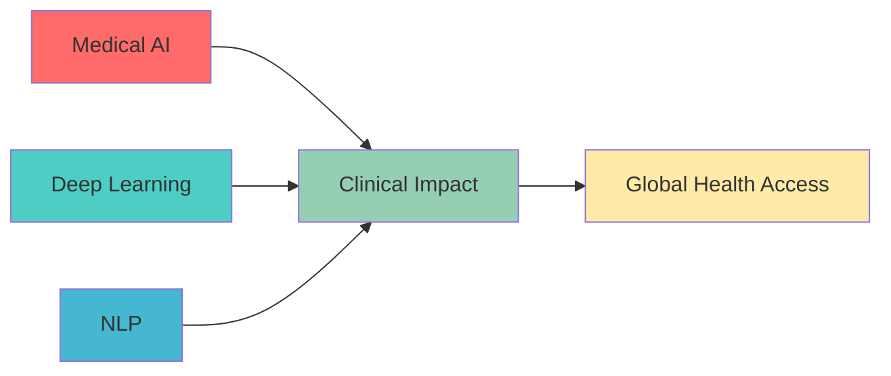

# 👋 Hi, I'm Yanampally Abhiram Reddy

 

---

## 🎯 About Me

> **AI/ML Researcher** specializing in **Medical AI**, **Deep Learning**, and **Natural Language Processing**

🎓 **BTech in Information Technology** at **IIITM Gwalior** (2022-2026) | **CGPA: 7.84**  
🔬 **Research Focus**: Medical Image Analysis, Federated Learning, Computer Vision, NLP  
🏥 Currently developing **FDA-aligned medical devices** with **laser-based diagnostics**  
📊 **Published researcher** with papers in **IEEE BIBM 2024** and **IEEE IATMSI 2025**

---

## 🚀 Current Research Positions

<table>
<tr>
<td width="50%">

### 🏥 ML Research Intern
**LightHearted AI** | *June 2025 - Present*
- 🔬 Developing **non-contact medical device** for ECG, heart sounds & BP analysis
- ⚡ **AI-assisted diagnosis in <10 seconds**
- 🎯 Working toward **FDA approval**
- 🧠 Training **ViT models** for cardiovascular condition detection

</td>
<td width="50%">

### 🔬 Research Intern  
**IIT Hyderabad** | *May 2025 - Present*
- 🌐 Advancing **UMedPT** foundational medical vision-language model
- 🔒 Implementing **federated learning** & **differential privacy**
- 🏥 Multi-center medical dataset curation
- ⚖️ Ensuring **fairness** and **clinical reliability**

</td>
</tr>
<tr>
<td>

### 🎥 Research Intern
**IIT Patna** | *May 2025 - Present*
- 🏃 **Temporal video grounding** in sports using transformers
- 🎯 **Moment-DETR** and **UniVTG** architectures
- 📊 Optimizing temporal alignment modules
- 🔄 Domain adaptation from sports to clinical videos

</td>
<td>

### 📊 Research Intern
**IIITM Gwalior** | *April 2024 - December 2024*
- 🧠 **Deep learning** for medical image analysis
- 📄 **IEEE BIBM 2024** publication
- 🔍 **Doppler angle estimation** with XAI
- 📱 Mobile-optimized deployment

</td>
</tr>
</table>

---

## 📚 Publications & Research Impact

### 🏆 Featured Publications

#### 🩺 [Deep Learning Framework for Doppler Angle Estimation with XAI](https://ieeexplore.ieee.org/document/10822074)
**IEEE BIBM 2024** | *Y. A. Reddy et al.*
- 🎯 **Dice Score: 0.96** with UNET architectures
- 📐 **Mean Error: -3.2°** for angle estimation  
- 🔍 **GradCAM XAI** for clinical interpretability
- 📱 Optimized for **mobile deployment**

#### 🌍 [High-Resource Translation: English to Telugu](https://arxiv.org/abs/2504.05914)
**IEEE IATMSI 2025** | *Accepted*
- 🔄 **Transfer learning** from Helsinki-NLP model
- ⚡ **FlashAttention** for 40% GPU memory reduction
- 📊 **BLEU Score: 11.69** benchmark achievement
- 🎯 **16K vocabulary** SentencePiece tokenizer

#### 📊 [Real-Time Sentiment Analysis Dashboard](https://arxiv.org/abs/2504.15448)
**arXiv 2025** | *Y. Abhiram Reddy et al.*
- 🎯 **87.6% accuracy** with hybrid VADER + DistilBERT
- 🏢 **Corporate Sentiment Index (CSI)** across 20+ corporations
- ⚡ **Real-time processing** with snscrape integration
- 📈 Applications in financial forecasting & crisis management

---

## 💻 Notable Projects

<b>🛡️ Network Security Anomaly Detection</b>

- 🧠 **Autoencoder + Classifier** architecture using PyTorch
- ⚖️ **SMOTE** for imbalanced data handling
- 📡 **Real-time packet sniffing** with Tshark
- 🔗 [Medium Article](https://medium.com/@abhiyanampally/cicids-2017-dataset-anomaly-detection-using-autoencoders-c10f9d7d15cd)

<b>🌍 NER Location Detection for Emergency Response</b>

- 🎯 **93% accuracy** using spaCy
- 📱 Specialized for **social media content**
- 🚨 **Emergency response automation**
- 🔗 [Medium Article](https://medium.com/@abhiyanampally/ner-location-detection-using-spacy-a-step-by-step-guide-194c7c6a3d7e)

<b>🏏 CricketGPT - RAG-based Sports Chatbot</b>

- 🚀 **RAG architecture** with LangChain & FastAPI
- ⚡ **50% reduction** in lookup times
- 🧠 **Mixtral-22b** integration
- 🔗 [Medium Article](https://medium.com/@abhiyanampally/simplest-introduction-to-rag-and-langchain-building-a-cricket-chatbot-part-i-0b98a658ee6f)

<b>📝 Scribble - AI-Powered Note-Taking</b>

- ✨ **Rich text editing** with React.js & TipTap.js
- 🔐 **Secure authentication** using Appwrite
- 🤖 **ChatGPT integration** for smart features
- 🌐 [Live Demo](https://scribble-k76k.vercel.app)

<b>👥 Autoencoder Recommendation System</b>

- 📊 Processed **20M+ ratings** using PyTorch
- 📈 **15% improvement** in recommendation accuracy
- 🤝 Advanced **collaborative filtering**
- 🔗 [Medium Article](https://medium.com/@abhiyanampally/building-a-simple-autoencoder-model-for-collaborative-filtering-based-recommendation-system-using-b6205b164927)

---

## 🛠️ Technical Arsenal

### 🐍 Languages

### 🤖 AI/ML Stack

### 🌐 Web Development

### ☁️ Cloud & DevOps

---

## 📊 GitHub Analytics

<table>
<tr>
<td width="50%">

</td>
<td width="50%">

</td>
</tr>
<tr>
<td colspan="2" align="center">

</td>
</tr>
</table>

---

## 🌟 Research Impact & Recognition

<table>
<tr>
<td width="50%" align="center">

### 📊 Research Metrics

**Impact Score**: Clinical-grade AI with real-world deployment

</td>
<td width="50%" align="center">

### 🎯 Key Achievements

🩺 **FDA-aligned** medical device development  
🧠 **Clinical-grade** AI models (Dice: 0.96)  
🌐 **Multi-institutional** collaborations  
📱 **Mobile-optimized** deployment strategies  
🔒 **Privacy-preserving** ML implementations  

**Collaborators**: AIIMS Delhi, NHS, University of Alberta

</td>
</tr>
</table>

### 🏆 Recognition Highlights

<table>
<tr>
<td align="center" width="25%">

 <b>Medical AI</b>
 FDA-track development
</td>
<td align="center" width="25%">

 <b>Deep Learning</b>
 Clinical deployment
</td>
<td align="center" width="25%">

 <b>Research</b>
 3 Publications
</td>
<td align="center" width="25%">

 <b>Collaboration</b>
 Multi-institutional
</td>
</tr>
</table>

---

## 🤝 Let's Collaborate!

<table>
<tr>
<td width="60%" align="center">

### 🚀 Research Interests

**🔬 Open to collaborations in:**
- Medical AI & Clinical Deployment
- Federated Learning & Privacy
- Computer Vision for Healthcare
- NLP for Medical Applications

</td>
<td width="40%" align="center">

### 📬 Connect With Me

---

</td>
</tr>
</table>

### 💭 Research Philosophy

<blockquote>

<em>"Building AI systems that save lives and democratize healthcare access"</em>
  
<strong>🎯 Mission:</strong> Bridging the gap between cutting-edge AI research and real-world clinical applications
 
<strong>🌍 Vision:</strong> Making advanced medical diagnostics accessible globally through mobile-optimized AI

</blockquote>

